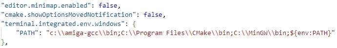
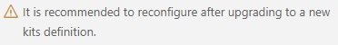

Install & Setup
===
This assumes you have the Bebbo GCC compiler installed and working (see [here](https://github.com/0wen101/vscode-amiga-gcc-example-prb28)). That is the basis and is extended here a bit to build ACE.

To build ACE examples (and the ACE engine itself), some more tools are needed :

1. [**CMake for Windows**](https://cmake.org/download/) - the build system used by ACE

2. [**MinGW**](https://sourceforge.net/projects/mingw/files/Installer/mingw-get-setup.exe/download) - Minimalist GNU for Windows -  allow Windows CMake to create Windows make files


3. [**AmigaCMakeCrossToolchains**](https://github.com/AmigaPorts/AmigaCMakeCrossToolchains) - the configuration for GCC. 
<br>Assuming Git is installed, use this command to clone this repo to c for example:

    ```
    git clone https://github.com/AmigaPorts/AmigaCMakeCrossToolchains /c/AmigaCMakeCrossToolchains/
    ```

    once done, as per [instructions](https://github.com/AmigaPorts/AmigaCMakeCrossToolchains) 
    , copy Generic.cmake to AmigaOS.cmake (i.e. make a copy of file Generic.cmake and rename it to AmigaOS.cmake)<br>
<br>

**File Path**
<br>After installing these it's necessary to add them to the path. You can either use your Windows path or set it in VS Code.
<br>To set the path in VS Code, press Ctrl Shift P for the command palette, type '**Preferences Open User Settings JSON**' and then select it when appears to open the  settings file.

Edit the path as show:




VS Code plugins
--

Next, install these extensions in VS Code.   Press Ctrl Shift X to access Extensions in VS Code.


That should be all that's required to start building. Clone this workspace if haven't already:

```
git clone https://github.com/0wen101/vscode-amiga-gcc-ACE-helloworld
```
Then open VS Code (File menu /Open Workspace from File..). Usually you will get a CMake message if first time opening the repo:



Ignore this for now. 


