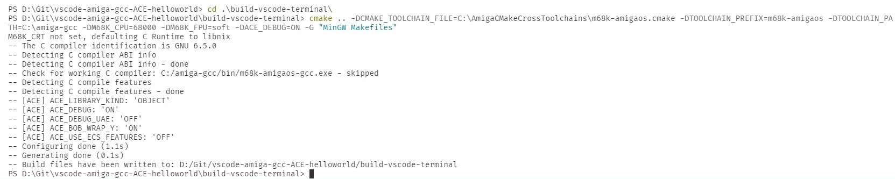
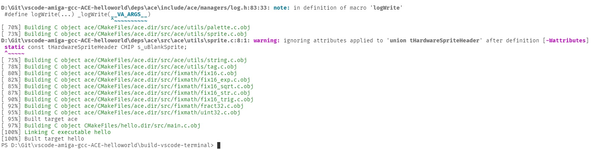
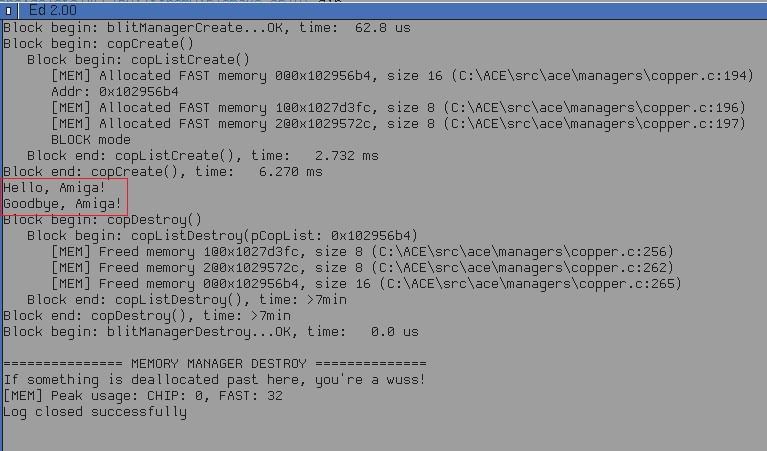
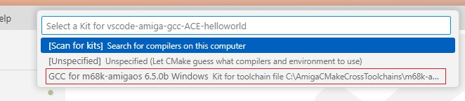
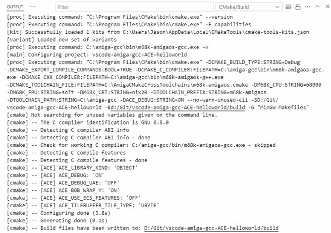
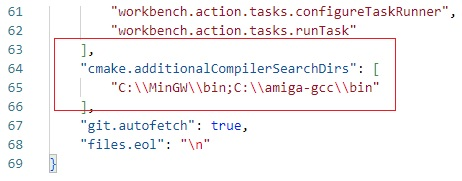
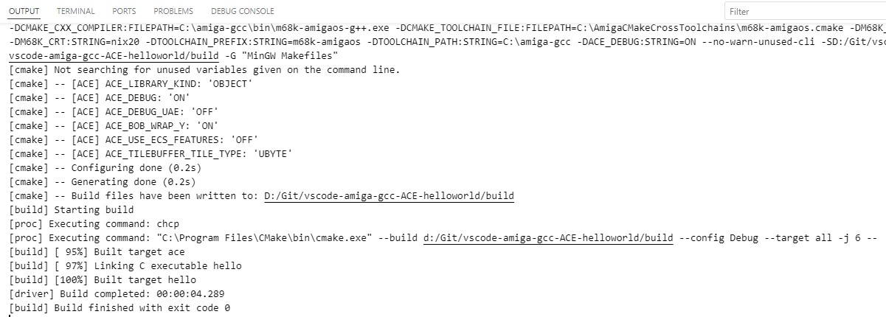

Building the code
----


As the examples require the ACE engine, we need to add that as dependacy to our project. The engine will only need to be built once.

**ACE & Git Submodule**
<br>You can build and setup ACE as either a git Submodule or as a c static library (libace.a) to link to your own code when compiling.<br>
Submodule is the recommended approach so will use that.<br>The project is already configured with ACE as a Git submodule (see file '.gitmodules') - it just needs to be updated.<br>
If not there already, make a 'deps/ace' sub folder in your workspace folder like so (Git Bash for example):

```
cd /c/Git/vscode-amiga-gcc-ACE-helloworld
mkdir deps
cd deps
mkdir ace
```
Then update with the correct version of ACE (main is the current branch, be sure your local branch is on that) : 
```
cd /c/Git/vscode-amiga-gcc-ACE-helloworld
git submodule update --init --recursive
cd deps/ace
git checkout main
```
This will add the correct ACE repo we need to the deps/ace sub folder.

build in terminal
---
Before we look at how build ACE stuff in VS Code with a key press, it's useful to look at the command line first to see whats going on and get a bit more detail with understanding.

With the workspace open in VS Code, open a new Terminal window and type this to create a makefile:
```
mkdir build

cd build

cmake .. -DCMAKE_TOOLCHAIN_FILE=C:\AmigaCMakeCrossToolchains\m68k-amigaos.cmake -DTOOLCHAIN_PREFIX=m68k-amigaos -DTOOLCHAIN_PATH=C:\amiga-gcc -DM68K_CPU=68000 -DM68K_FPU=soft -DACE_DEBUG=ON -G "MinGW Makefiles"
```

 ``note if you install AmigaCMakeCrossToolchains to a different location, then remember to update all path references``

you should see this output:



That creates Bebbos GCC compatible Makefiles.<br> At least two makesfiles are created - one for the sub module. And another for the hello world Amiga exe.
<br>The next step is to compile the Amiga exe using that same Makefile.<br>
To do that use this command (dont forget the '.' character after --build) :

```
cmake --build . 
```



You will see a couple of warnings during the build but ignore them for now.<br>
The build object files if interested can be found in '.dir' subfolders inside the build folder. 

**Build Errors**

A common error when building is a message regarding missing MinGW in your Windows system.
```
CMake Error: CMake was unable to find a build program corresponding to "MinGW Makefiles".  CMAKE_MAKE_PROGRAM is not set.  You probably need to select a different build tool.
-- Configuring incomplete, errors occurred!
```
This probably indicates MinGW is either not installed or not on your windows path. See previous page on how to edit the path VS Code uses.

Later we can get VS Code to automatically run the built exe by pressing F5, but for now test the exe by manually copying it to your Amiga or WinUAE and running it. 
<br>The hello executable produces a 'game.log' file containing the text 'Hello, Amiga!'



``note: ACE is required to be in 'Debug Mode' to produce the game.log file.
Enable it with the build flag 'ACE_DEBUG=ON' when creating the Makefile with CMake.``


build with VS code
--

To build ACE via VS Code commands instead of command line some further configuration is required.<br>
1. Create a new empty 'build' folder in your workspace.
2. Next is to configure CMake 'kits' to let the CMake VS Code plugin know about the compilers installed on your system.<br>To do that (assuming you have installed the required VS Code plugins), press Ctrl Shift P, the select the command '**CMake Edit User-Local CMake Kits**' to open cmake-tools-kits.json.
<br>
Paste this in (from old drive) so the file looks like this (change paths if needed):
```
[
  {
    "name": "GCC for m68k-amigaos 6.5.0b Windows",
    "compilers": {
      "C": "C:\\amiga-gcc\\bin\\m68k-amigaos-gcc.exe",
      "CXX": "C:\\amiga-gcc\\bin\\m68k-amigaos-g++.exe"
    },
    "isTrusted": true,
    "environmentVariables": {
      "CMT_MINGW_PATH": "C:\\MinGW\\bin"
    },
    "preferredGenerator": {
      "name": "MinGW Makefiles"
    },
    "toolchainFile": "C:\\AmigaCMakeCrossToolchains\\m68k-amigaos.cmake",
    "cmakeSettings": {
      "M68K_CPU": "68000",
      "M68K_FPU": "soft",
      "M68K_CRT": "nix20",
      "TOOLCHAIN_PREFIX": "m68k-amigaos",
      "TOOLCHAIN_PATH": "C:\\amiga-gcc",
      "ACE_DEBUG":"ON"
    }
  }
]
```
Restart vs code to pick up the kit changes.

3. Pres Ctrl Shift P again and select CMake: 'Select a kit'



Select GCC for m68k. CMake will then execute and create Makefiles, similar to that seen when using the Terminal window:



If having issues, it's worth rechecking the compiler location has been correctly set. Press Ctrl Shift P and select **Preferences: Open user settings** and add this under 'additionalCompilerSearchDirs' :



Save and re-open VS Code. Press Ctrl Shift P again and select **CMAKE: Configure**. 
<br>This should re-create the Makefile again. There should be no errors reported.

4. When the Makefile is generating correctly, press **F7** to start building the actual Amiga executable (aswell as ACE itself if it hasnt been built already)
<br>You may be presented with the kit selection again, if so, select the Amiga GCC compiler if requested.



The project is configured to copy the built exe from the build folder to the UAE\DH0 folder for WinUAE to run.
This is done in the CMakeLists.txt file:
```
#post build copy the target

add_custom_command(TARGET ${TARGET_NAME} POST_BUILD
    COMMAND ${CMAKE_COMMAND} -E copy $<TARGET_FILE:${TARGET_NAME}> ../uae/DH0/${TARGET_NAME}
    #COMMENT "Created ${PROJECT_BINARY_DIR}/test_base.exe"
)
```
