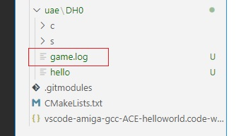
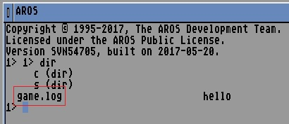

Run the code
----

Press **F5**, or, if you like, go to the Run & Debug window and press the play icon.
 This will start WinUAE.  The startup-sequence on the Amiga configuration is set to run our built hello exe at startup (creates a game.log file in the same folder which contains the actual hello message).

 

Run & Debug, if not familiar with, is configured in the file launch.json. This contains one configuration - 'Run'. 

**Errors**
 The startup-sequence file in the uae\DH0\s folder should start the exe automatically. Maybe due to line endings, sometimes if this file is edited in Notepad for example in windows, I get "object not found" errors when WinUAE tries to run the script. The fix is to open it on the Amiga and save it.

